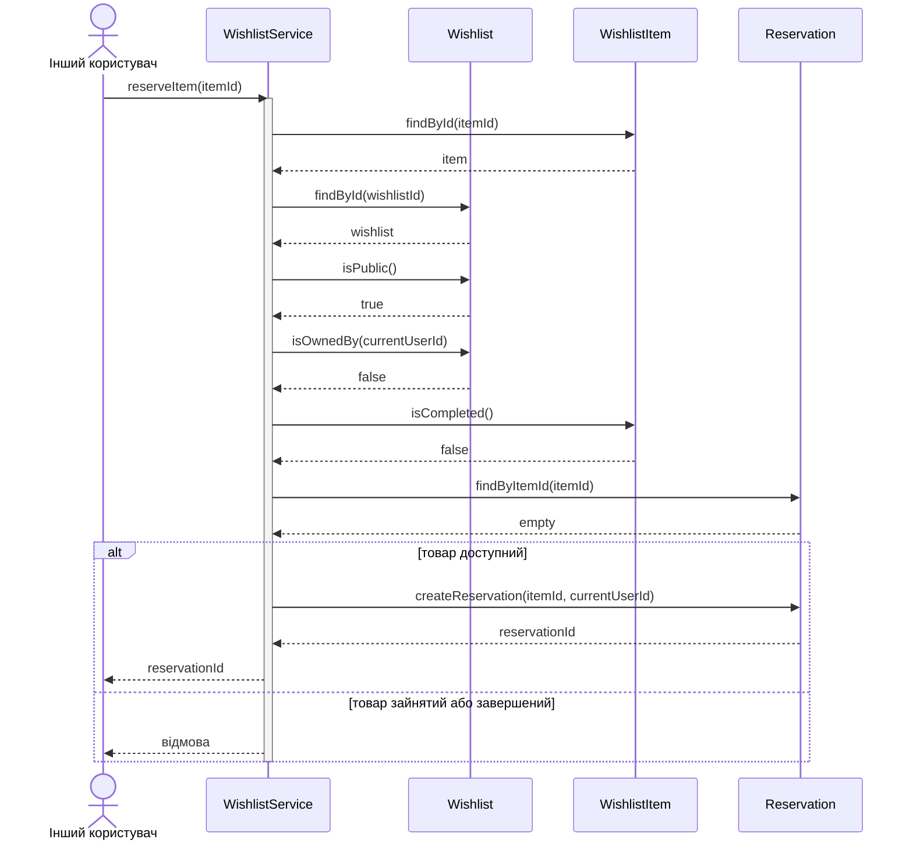

# SC-03. Успішне бронювання товару

```mermaid
sequenceDiagram
    actor User as Інший користувач
    participant S as WishlistService
    participant W as Wishlist
    participant Item as WishlistItem
    participant R as Reservation

    User->>S: reserveItem(itemId)
    activate S
    S->>Item: findById(itemId)
    Item-->>S: item
    S->>W: findById(wishlistId)
    W-->>S: wishlist
    S->>W: isPublic()
    W-->>S: true
    S->>W: isOwnedBy(currentUserId)
    W-->>S: false
    S->>Item: isCompleted()
    Item-->>S: false
    S->>R: findByItemId(itemId)
    R-->>S: empty

    alt товар доступний
        S->>R: createReservation(itemId, currentUserId)
        R-->>S: reservationId
        S-->>User: reservationId
    else товар зайнятий або завершений
        S-->>User: відмова
    end
    deactivate S
```
