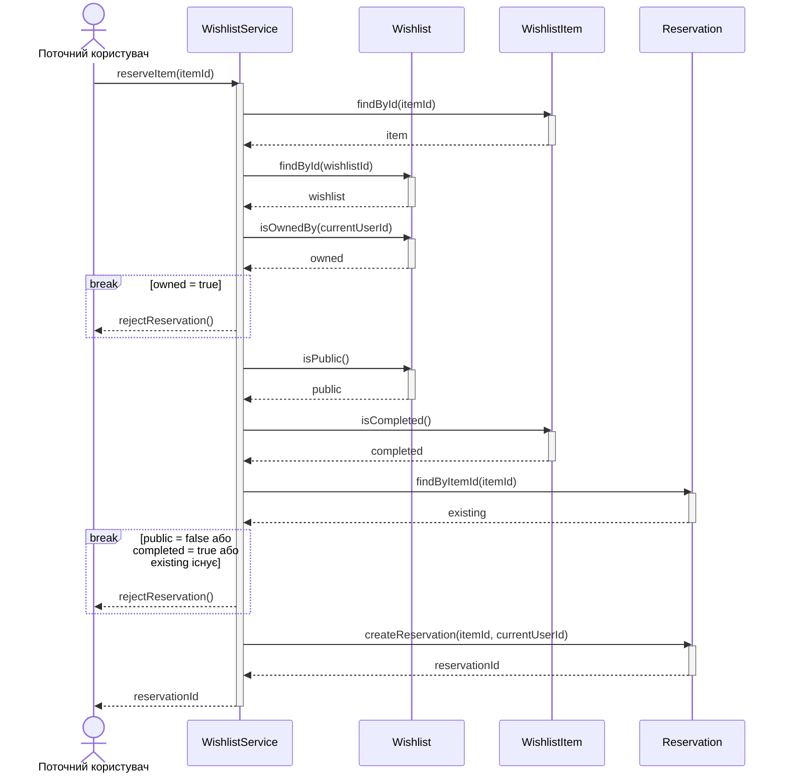

# SC-04. Спроба забронювати власний товар

```mermaid
sequenceDiagram
    actor User as Поточний користувач
    participant S as WishlistService
    participant W as Wishlist
    participant Item as WishlistItem
    participant R as Reservation

    User->>S: reserveItem(itemId)
    activate S
    S->>Item: findById(itemId)
    activate Item
    Item-->>S: item
    deactivate Item
    S->>W: findById(wishlistId)
    activate W
    W-->>S: wishlist
    deactivate W
    S->>W: isOwnedBy(currentUserId)
    activate W
    W-->>S: owned
    deactivate W

    break owned = true
        S-->>User: rejectReservation()
    end
    S->>W: isPublic()
    activate W
    W-->>S: public
    deactivate W
    S->>Item: isCompleted()
    activate Item
    Item-->>S: completed
    deactivate Item
    S->>R: findByItemId(itemId)
    activate R
    R-->>S: existing
    deactivate R
    break public = false або completed = true або existing існує
        S-->>User: rejectReservation()
    end
    S->>R: createReservation(itemId, currentUserId)
    activate R
    R-->>S: reservationId
    deactivate R
    S-->>User: reservationId
    deactivate S
```
