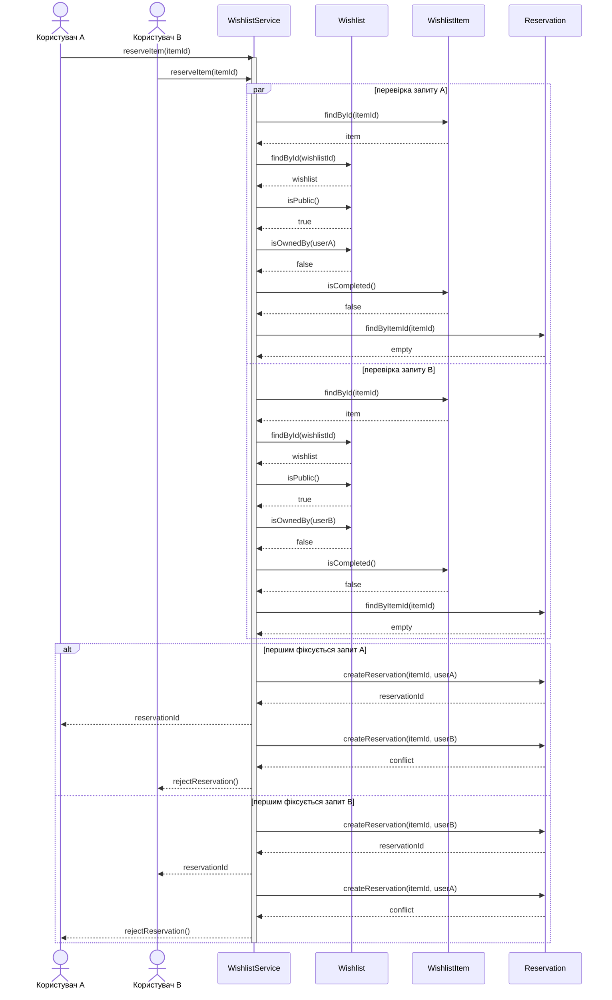

# SC-12. Одночасне бронювання одного товару

```mermaid
sequenceDiagram
    actor A as Користувач A
    actor B as Користувач B
    participant S as WishlistService
    participant W as Wishlist
    participant Item as WishlistItem
    participant R as Reservation

    A->>S: reserveItem(itemId)
    activate S
    B->>S: reserveItem(itemId)

    par перевірка запиту A
        S->>Item: findById(itemId)
        Item-->>S: item
        S->>W: findById(wishlistId)
        W-->>S: wishlist
        S->>W: isPublic()
        W-->>S: true
        S->>W: isOwnedBy(userA)
        W-->>S: false
        S->>Item: isCompleted()
        Item-->>S: false
        S->>R: findByItemId(itemId)
        R-->>S: empty
    and перевірка запиту B
        S->>Item: findById(itemId)
        Item-->>S: item
        S->>W: findById(wishlistId)
        W-->>S: wishlist
        S->>W: isPublic()
        W-->>S: true
        S->>W: isOwnedBy(userB)
        W-->>S: false
        S->>Item: isCompleted()
        Item-->>S: false
        S->>R: findByItemId(itemId)
        R-->>S: empty
    end

    alt першим фіксується запит A
        S->>R: createReservation(itemId, userA)
        R-->>S: reservationId
        S-->>A: reservationId
        S->>R: createReservation(itemId, userB)
        R-->>S: conflict
        S-->>B: rejectReservation()
    else першим фіксується запит B
        S->>R: createReservation(itemId, userB)
        R-->>S: reservationId
        S-->>B: reservationId
        S->>R: createReservation(itemId, userA)
        R-->>S: conflict
        S-->>A: rejectReservation()
    end
    deactivate S
```
