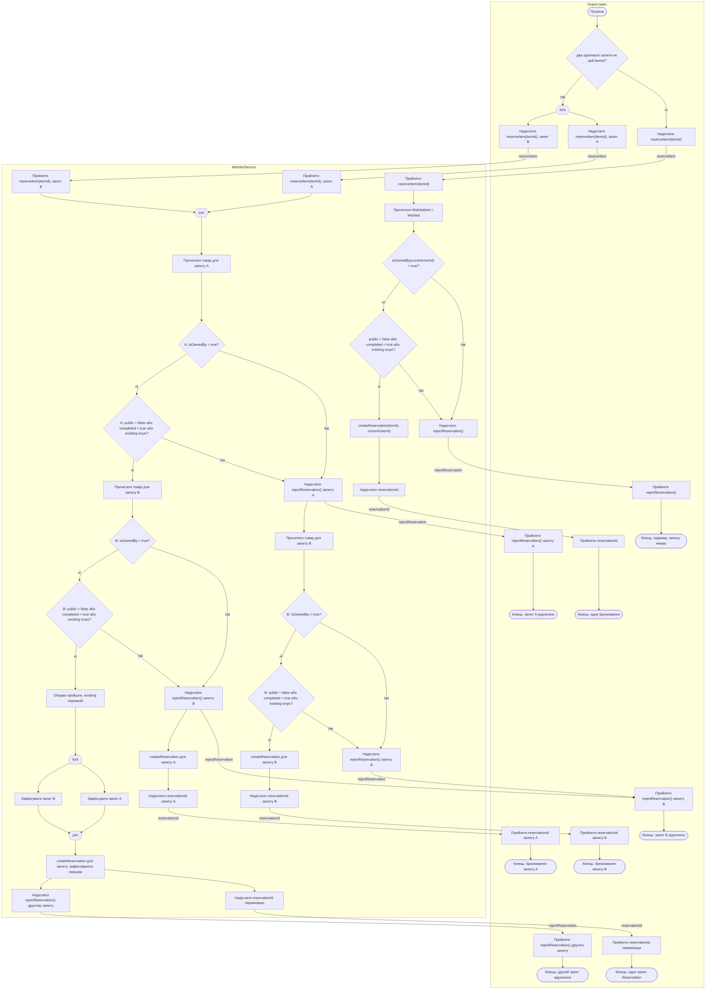

```mermaid
flowchart TD
  subgraph userLane ["Користувач"]
    start([Початок])
    how{"два одночасні запити на цей itemId?"}
    sendOne["Надіслати reserveItem(itemId)"]
    sendA["Надіслати reserveItem(itemId), запит A"]
    sendB["Надіслати reserveItem(itemId), запит B"]
    forkIn{{"fork"}}
    takeId["Прийняти reservationId"]
    takeNo["Прийняти rejectReservation()"]
    endOk([Кінець: одне бронювання])
    endNo([Кінець: відмова, запису немає])
    takeNoA["Прийняти rejectReservation() запиту A"]
    takeNoB["Прийняти rejectReservation() запиту B"]
    endNoA([Кінець: запит A відхилено])
    endNoB([Кінець: запит B відхилено])
    takeIdA["Прийняти reservationId запиту A"]
    takeIdB["Прийняти reservationId запиту B"]
    endOnlyA([Кінець: бронювання запиту A])
    endOnlyB([Кінець: бронювання запиту B])
    takeWin["Прийняти reservationId переможця"]
    takeLose["Прийняти rejectReservation() другого запиту"]
    endWin([Кінець: один запис Reservation])
    endLose([Кінець: другий запит відхилено])
  end

  subgraph serviceLane ["WishlistService"]
    takeOne["Прийняти reserveItem(itemId)"]
    read["Прочитати WishlistItem і Wishlist"]
    own{"isOwnedBy(currentUserId) = true?"}
    guard{"public = false або completed = true або existing існує?"}
    createOne["createReservation(itemId, currentUserId)"]
    sendNo["Надіслати rejectReservation()"]
    sendId["Надіслати reservationId"]
    takeA["Прийняти reserveItem(itemId), запит A"]
    takeB["Прийняти reserveItem(itemId), запит B"]
    joinIn{{"join"}}
    readA["Прочитати товар для запиту A"]
    ownA{"A: isOwnedBy = true?"}
    guardA{"A: public = false або completed = true або existing існує?"}
    sendNoA["Надіслати rejectReservation() запиту A"]
    readBf["Прочитати товар для запиту B"]
    ownBf{"B: isOwnedBy = true?"}
    guardBf{"B: public = false або completed = true або existing існує?"}
    sendNoBf["Надіслати rejectReservation() запиту B"]
    createB["createReservation для запиту B"]
    sendIdB["Надіслати reservationId запиту B"]
    readBp["Прочитати товар для запиту B"]
    ownBp{"B: isOwnedBy = true?"}
    guardBp{"B: public = false або completed = true або existing існує?"}
    sendNoBp["Надіслати rejectReservation() запиту B"]
    createA["createReservation для запиту A"]
    sendIdA["Надіслати reservationId запиту A"]
    bothReady["Обидва пройшли, existing порожній"]
    forkW{{"fork"}}
    attemptA["Зафіксувати запит A"]
    attemptB["Зафіксувати запит B"]
    joinW{{"join"}}
    createRace["createReservation для запиту, зафіксованого першим"]
    sendWin["Надіслати reservationId переможцю"]
    sendLose["Надіслати rejectReservation() другому запиту"]
  end

  start --> how
  how -->|ні| sendOne
  sendOne -->|reserveItem| takeOne
  takeOne --> read --> own
  own -->|так| sendNo
  own -->|ні| guard
  guard -->|так| sendNo
  guard -->|ні| createOne
  sendNo -->|rejectReservation| takeNo --> endNo
  createOne --> sendId
  sendId -->|reservationId| takeId --> endOk

  how -->|так| forkIn
  forkIn --> sendA
  forkIn --> sendB
  sendA -->|reserveItem| takeA
  sendB -->|reserveItem| takeB
  takeA --> joinIn
  takeB --> joinIn
  joinIn --> readA --> ownA
  ownA -->|так| sendNoA
  ownA -->|ні| guardA
  guardA -->|так| sendNoA
  sendNoA -->|rejectReservation| takeNoA --> endNoA
  sendNoA --> readBf --> ownBf
  ownBf -->|так| sendNoBf
  ownBf -->|ні| guardBf
  guardBf -->|так| sendNoBf
  guardBf -->|ні| createB
  sendNoBf -->|rejectReservation| takeNoB --> endNoB
  createB --> sendIdB
  sendIdB -->|reservationId| takeIdB --> endOnlyB

  guardA -->|ні| readBp --> ownBp
  ownBp -->|так| sendNoBp
  ownBp -->|ні| guardBp
  guardBp -->|так| sendNoBp
  sendNoBp -->|rejectReservation| takeNoB
  sendNoBp --> createA
  createA --> sendIdA
  sendIdA -->|reservationId| takeIdA --> endOnlyA
  guardBp -->|ні| bothReady --> forkW
  forkW --> attemptA
  forkW --> attemptB
  attemptA --> joinW
  attemptB --> joinW
  joinW --> createRace
  createRace --> sendWin
  createRace --> sendLose
  sendWin -->|reservationId| takeWin --> endWin
  sendLose -->|rejectReservation| takeLose --> endLose
```
