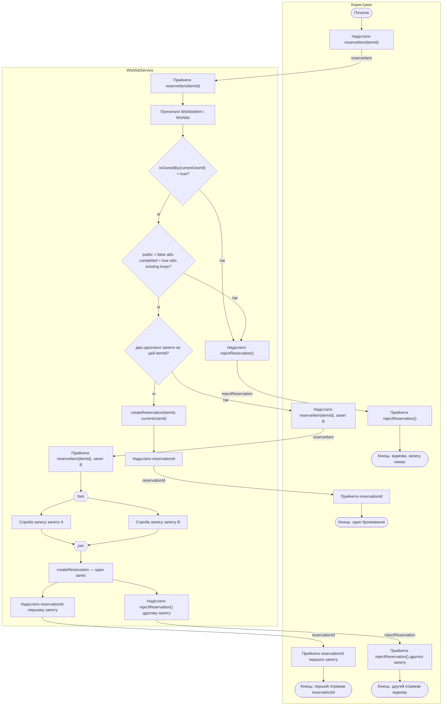

```mermaid
flowchart TD
  subgraph userLane ["Користувач"]
    start([Початок])
    sendA["Надіслати reserveItem(itemId)"]
    sendB["Надіслати reserveItem(itemId), запит B"]
    takeId["Прийняти reservationId"]
    takeNo["Прийняти rejectReservation()"]
    endOk([Кінець: одне бронювання])
    endNo([Кінець: відмова, запису немає])
    takeIdA["Прийняти reservationId першого запиту"]
    takeNoB["Прийняти rejectReservation() другого запиту"]
    endA([Кінець: перший отримав reservationId])
    endB([Кінець: другий отримав відмову])
  end

  subgraph serviceLane ["WishlistService"]
    takeReq["Прийняти reserveItem(itemId)"]
    takeReqB["Прийняти reserveItem(itemId), запит B"]
    read["Прочитати WishlistItem і Wishlist"]
    own{"isOwnedBy(currentUserId) = true?"}
    guard{"public = false або completed = true або existing існує?"}
    two{"два одночасні запити на цей itemId?"}
    createOne["createReservation(itemId, currentUserId)"]
    sendNo["Надіслати rejectReservation()"]
    sendId["Надіслати reservationId"]
    fork{{"fork"}}
    attemptA["Спроба запису запиту A"]
    attemptB["Спроба запису запиту B"]
    join{{"join"}}
    createRace["createReservation — один запис"]
    sendIdA["Надіслати reservationId першому запиту"]
    sendNoB["Надіслати rejectReservation() другому запиту"]
  end

  start --> sendA
  sendA -->|reserveItem| takeReq
  takeReq --> read --> own
  own -->|так| sendNo
  own -->|ні| guard
  guard -->|так| sendNo
  guard -->|ні| two
  sendNo -->|rejectReservation| takeNo --> endNo
  two -->|ні| createOne --> sendId
  sendId -->|reservationId| takeId --> endOk
  two -->|так| sendB
  sendB -->|reserveItem| takeReqB --> fork
  fork --> attemptA
  fork --> attemptB
  attemptA --> join
  attemptB --> join
  join --> createRace
  createRace --> sendIdA
  createRace --> sendNoB
  sendIdA -->|reservationId| takeIdA --> endA
  sendNoB -->|rejectReservation| takeNoB --> endB

```